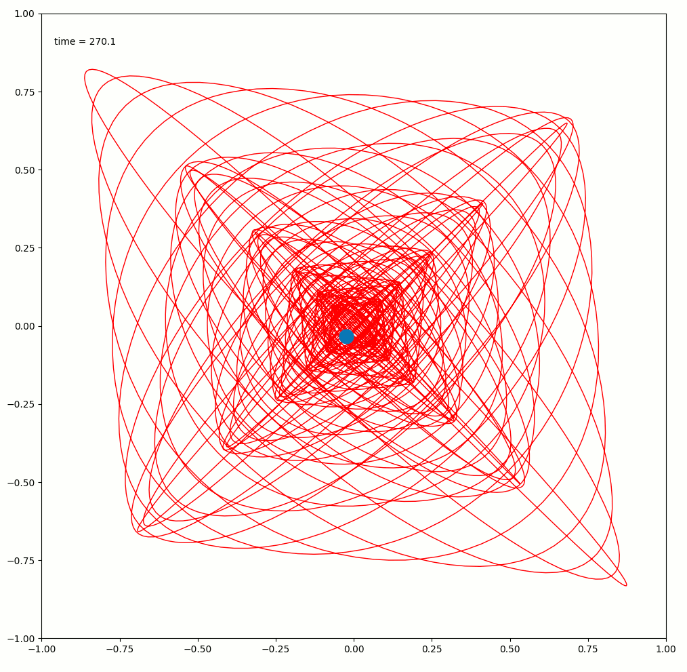
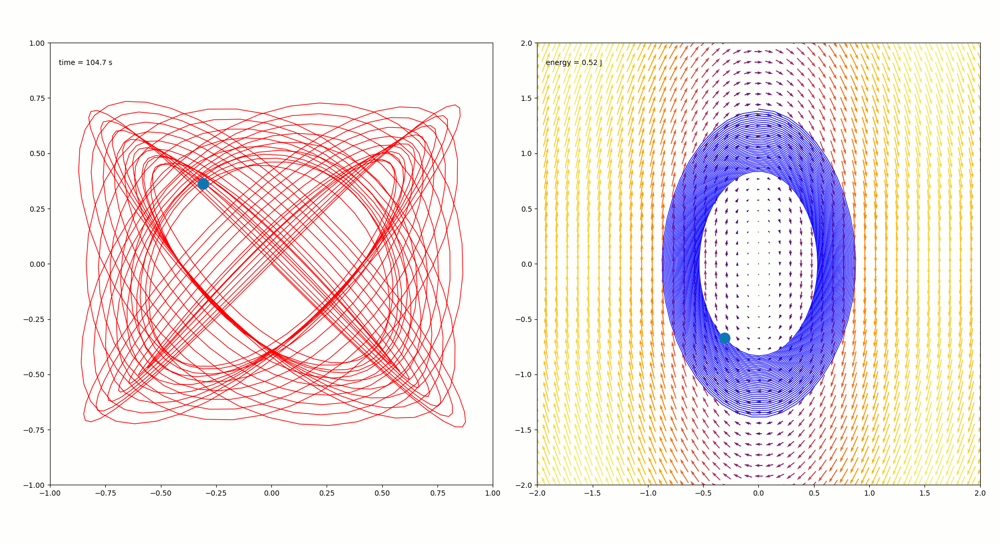

# sand-tracer
A simulator for a Sand Pendulum, constructed for the UOIT Science Rendezvous

This software has three components:
 1. sand-tracer.py :: *Generates xy-plots of double pendulum simulation*
 2. sand-tracer-pp.py :: *Generates xy-plots and a phase-portrait*
 3. sand-tracer.ipnb :: *A jupyter iPython notebook demonstrating code and math.*

 To model a 2D-pendulum, I'll divide it into two single-dimensional pendulums. Since we only need to work on one dimension at a time, let us consider Newton's equation of motion for a pendulum with drag in a single dimension:

 $$
 \ddot\theta - \frac{g}{m\,r}\,\sin\theta + \frac{b}{m}\,\dot{\theta} = 0.
 $$

 The $\sin\theta$ term is the restoration term. It is the balance of tension and gravity coercing the pendulum pith back towards the resting position. The $\dot{\theta}$ term is the drag term. It represents parasitic losses from the air drag on the ball, and friction in the hinges. Notice that it is proportional to velocity: the faster things move, the faster energy is lost to the environment.

 It is useful to represent the system as a vector valued function on a two-dimensional state space ${x}\in\mathbf{R}$ where the first dimension is the angular displacement, $\theta$, and the second dimension is the angular speed $\dot{\theta} = \omega$. The vector equation for the system is

 $$
 \dot{{x}} = \frac{\mathrm{d}}{\mathrm{d}t}\begin{bmatrix}\theta\\ \dot\theta\end{bmatrix} = \begin{bmatrix}\dot\theta\\ \frac{-g}{m\,r}\sin\theta + \frac{b}{m}\,\dot{\theta}\end{bmatrix} =: {f}({x}),
 $$

Each of the three components solve  


## sand-tracer.py


The `sand-tracer.py` program produces images approximating the sand-trails produced by the sand-pendulum, such as this one:



To controll the initial conditions, and produce different plots, you'll want to play around with these lines:

```{Python id:"j2jwzkgc"}
preset.append(dict(r=[2, 1.4], b=0.01))
preset.append(dict(r=[2, 1.8], b=0.02))
sim = PendulumSimulatorIterator(**preset[1], dt=0.03)
```

There are a couple of presets available, but you can construct more. You simply need to specify the lengths of the x- and y-pendulums, and the drag coefficient.


## sand-tracer-pp.py


The `sand-tracer-pp.py` program produces a side-by-side animation, such as this one:



The plot on the left is what is produced by the vanilla `sand-tracer.py`. The plot on the right is the phase-portrait for the x-pendulum, and reports the energy of the system relative to the rest-energy. The usage is the same as the vanilla program.
