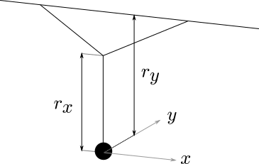

# sand-tracer
A simulator for a Sand Pendulum, constructed for the UOIT Science Rendezvous

This software has three components:
 1. sand-tracer.py :: *Generates xy-plots of double pendulum simulation*
 2. sand-tracer-pp.py :: *Generates xy-plots and a phase-portrait*
 3. sand-tracer.ipnb :: *A jupyter iPython notebook demonstrating code and math.*

To model a 2D-pendulum, I'll divide it into two single-dimensional pendulums. This is a strictly linear strategy, and the 2D pendulum is nonlinear. However, we will use two noninear pendulums to mitigate error (leaving only the nonlinearity in the coupling terms), and we can expect our approximation to hold well for small angles. The payoff for this approximation is that we can use the relatively simple dynamics of a single pendulum and aggregate two of them to form our approximation of a pendulum which may swing in both-directions.

In this exhibit, we explore the pendulum known in the literature as the *Y-suspended* pendulum, shown in the following Figure:

 * 

 * Fig: An illustration of the assymetric 2D pendulum. The presence of two pivots at lengths $r_x$ and $r_y$ produces a dissonance in the oscillation period in the $x$- and $y$-directions.

The suspension from two points, forming a $Y$, is responsible for the assymetric behvaiour in the $x$- vs. $y$-directions. In the $x$-direction, the pendulum pivots from the 3-way intersection at the 'Y', while in the $y$-direction, the whole 'Y' shape structe may swing, pivoting from the two points at the top-support.

Consider Newton's equation of motion for a pendulum with drag in a single dimension:

$$
 \ddot\theta - \frac{g}{r}\,\sin\theta + \frac{b}{m}\,\dot{\theta} = 0.
$$

The $\sin\theta$ term is the restoration term. It is the balance of tension and gravity coercing the pendulum pith back towards the resting position. The $\dot{\theta}$ term is the drag term. It represents parasitic losses from the air drag on the ball, and friction in the hinges. Notice that it is proportional to velocity: the faster things move, the faster energy is lost to the environment. It is known that a single term, linear in velocity, does not well model the losses in this sort of pendulum. However, for educational purposes, the accuracy of this model is easily adequate.

It is useful to represent the system as a vector valued function on a two-dimensional state space ${x}\in\mathbf{R}$ where the first dimension is the angular displacement, $\theta$, and the second dimension is the angular speed $\dot{\theta} = \omega$. The vector equation for the system is

$$
  \dot{{x}} = \frac{\mathrm{d}}{\mathrm{d}t}\begin{bmatrix}\theta\\ \dot\theta\end{bmatrix} = \begin{bmatrix}\dot\theta\\ \frac{-g}{r}\sin\theta + \frac{b}{m}\,\dot{\theta}\end{bmatrix} =: {f}({x}),
$$

The above equation is integrated in the software in order to simulate the trajectory of the pendulum.


## sand-tracer.py


The `sand-tracer.py` program produces images approximating the sand-trails produced by the sand-pendulum, such as this one:


To controll the initial conditions, and produce different plots, you'll want to play around with the initial conditions set near the very top of the source file:

```{Python}
initial_contidionts = dict(r=[.78, .9], b=0.04, xx0=[1, -.2], xy0=[-.33, .1])
```
or, use a preset:
```{Python}
initial_contidionts = presets['my2017']
```
Presets are stored in the `presets.py` file, and are merely a dictionary of values passed to the initialiser of the `PendulumState2D` class:
```
def __init__(self, r=[1, 1], m=0.5, b=0.2, g=9.807, dt=0.1,
             xx0=[0, 1],    # Initial state of x-pendulum
             xy0=[0, -1]):  # Initial state of y-pendulum
```
The `r` parameter is a list of two floats representing the lengs $r_x$ and $r_y$ from the illustration of the Y-suspended pendulum. The `dt` value is the time interval of a single iteration step in the simulation. This value does not affect accuracy of the simulation: only the intervals at which the state will be stored and plotted. The `xx0` and `xy0` are the inital conditions (a pair containing position and velocity) of the pendulums for the $x$- and $y$-directions. Mass, gravitational acceleration and the drag coefficient may also be set, but sensible defaults are in place if you chose not to specfy them.


## sand-tracer-pp.py


The `sand-tracer-pp.py` program produces a side-by-side animation, such as this one:


The plot on the left is what is produced by the vanilla `sand-tracer.py`. The plot on the right is the phase-portrait for the x-pendulum, and reports the energy of the system relative to the rest-energy.

The usage is identical to `sand-tracer.py`. Only the animation details are different.


## Changing the speed of plotting

There are two places in the code where you can change the speed of the animation. Forst, you may change inte interval passed to [`matplotlib.animate`](http://matplotlib.org/api/_as_gen/matplotlib.animation.FuncAnimation.html#matplotlib.animation.FuncAnimation). The line should look something like this:
```
ani = animation.FuncAnimation(
    fig, animate, pendulum_sim_generator, blit=True, interval=10)
```
The interval is specified in miliseconds. Specifying a large interval will slow the animation, but will lead to a jarring and visible transition from one frame of the animation to the next, as the time sampling becomes more and more coarse.

You may also change the value of `dt` passed to the constructor of `PendulumState2D` (described in section on `sand-tracer.py`). This doesn't change the accuracy of integration, but will lead to fewer calls to the integrator. This, however, makes the animation look coarse. In places where the pendulum moves quickly, a large `dt` value will make it apparent that the curve is constructed from line segments, and the corners will be visible.
